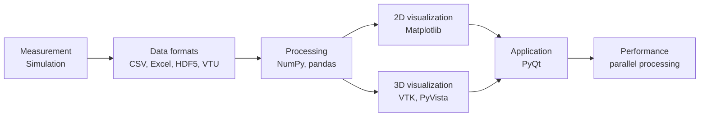

# Visualisierung & Datenaufbereitung

Engineering data rarely arrives in a form you can use. It comes out of a test
rig as a CSV file with the wrong units, out of a solver as a result file that no
spreadsheet can open, or off a sensor at a sampling rate that drifts. Turning
that into something a colleague can understand, and into a tool they can
actually use, is the work this course is about.

Over one semester you build the whole chain once: from the raw file through
processing and analysis to a 2D plot, a 3D view of a mesh, and finally a desktop
application with a user interface. Every step uses tools that are standard in
engineering practice today, and every step is done by hand at least once, so
that you know what the tools are doing for you.

You work in two languages, and on purpose. Python for most of what you build,
and C++ as this course's representative of the compiled languages, because the
difference between compiling and interpreting explains why the fast libraries
are fast, why simulation software is built the way it is, and where the limits
of a Python script actually lie.

## The thread through the semester

The same datasets follow you along this chain. The beam you load as a mesh in
the visualization block is the beam you display in your own Qt application a few
weeks later, and the motion data you record with your phone is the data you
filter, integrate and plot yourself.

## What you will be able to do

By the end of the semester you can take an unfamiliar engineering dataset, get
it into a usable shape, choose a representation that answers the question at
hand, and wrap the result in something another person can operate. You will have
written a small finite element solver from scratch, reconstructed a trajectory
from raw sensor data, and built a working viewer for simulation results.

Along the way you will have used Git the way teams use it: branches, pull
requests, review, and a repository whose history shows how the work actually
happened.

## How the course works

The material is organized in three layers. The chapters on this site are the
reference, complete and searchable. The slide decks in `slides/` carry the live
sessions. The assignments are practical, and they build on each other.

Assignments are handed in as pull requests in a private repository, reviewed,
and merged once they are accepted. The details are described in
[Course Organization](./organization.md) and in
[Submission Workflow](./tools-workflow/submission-workflow.md).

:::note Before the first assignment
Read [Submission Workflow](./tools-workflow/submission-workflow.md) once. It
explains which repository your work goes into, and how to keep your email
address out of a commit history that lasts forever.
:::

## What you need

You should be able to write a simple program in some language, and know what a
variable, a loop and a function are. Beyond that the course starts from the
beginning: the tools are installed together in the first session, and Python is
introduced from its basics.

Everything used here is free and runs on Windows, macOS and Linux. You need a
computer you can install software on, and a GitHub account.

## Where to start

Begin with [Course Organization](./organization.md) for the schedule and the
assessment, then work through
[Development Tools & Workflow](./tools-workflow/tools-workflow-overview.md) and
the [Kickoff Assignment](./tools-workflow/kickoff-assignment.md).
