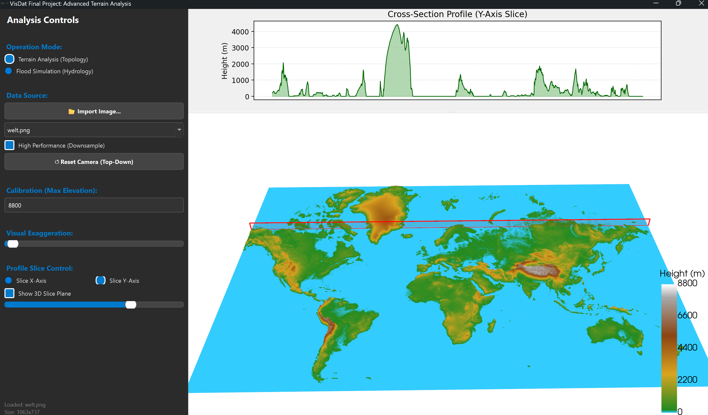
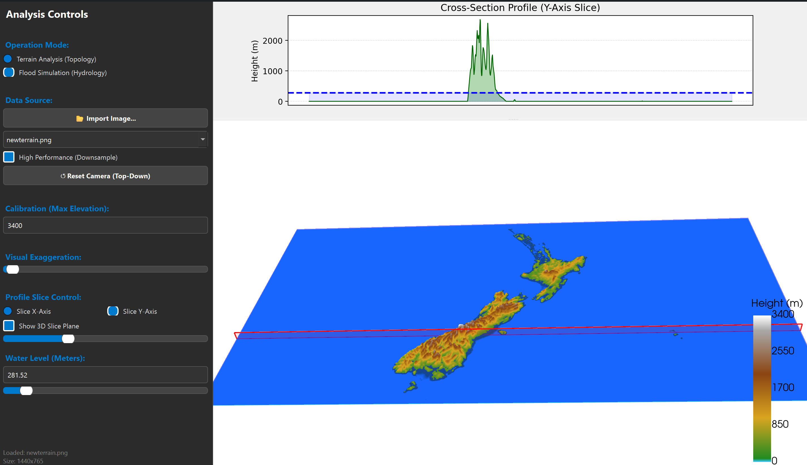

# Höhenprofilanalyse mit Hochwasser-Simulation
## Interaktive 3D-Visualisierung 

**Huemer Lukas**
Visualisierung & Datenverarbeitung

---

## Projektübersicht

**Das Ziel:**
Entwicklung einer Anwendung, die einfache 2D-Höhenkarten (Heightmaps) in interaktive 3D-Modelle verwandelt, um Geländeformen eine Hochwassersimulation durchzuführen.

**Kern-Features:**
* Echtzeit 3D-Rendering
* Synchronisierte 2D-Profilschnitte
* Hochwassersimulation

---

## Technischer Workflow

Wie entsteht das 3D-Modell?

1.  **Input:** Laden eines Graustufenbildes (https://tangrams.github.io/heightmapper/)
2.  **Transformation:**
    * Rotation um 90° (Korrektur des Koordinatensystems)
    * **Downsampling:** Optionale Reduktion der Auflösung
3.  **Grid-Erstellung** 
4.  **Warping:** Verschiebung der Z-Achse
5.  **Mapping:** Anwendung einer benutzerdefinierten Colormap

---

## Technische Herausforderungen (1/2)

**Herausforderung 1: Dynamische Skalierung & Synchronisation**

* **Das Problem:** Die Schnittebene ist kein statisches Objekt.
    1. **Bewegen** wenn der User den X/Y-Slider nutzt
    2. **Mitwachsen** bei "Visual Exaggeration" (Höhenverzerrung) änerdung, damit der Berg nicht oben aus der Ebene herausragt
* **Die Lösung:** 
    * Bei jeder Slider-Bewegung werden die 4 Eckpunkte der Ebene im 3D-Raum neu berechnet
    * Der Z-Wert der Ebene wird dynamisch an den aktuellen Exaggeration-Faktor gekoppelt (max_height * z_factor)
---

## Technische Herausforderungen (2/2)

**Herausforderung 2: Performance & Downsampling**

* **Das Problem:** Hochauflösende Bilder (z.B. 4K) erzeugen Millionen von Datenpunkten (Vertices). Das Rendern und live "Warpen" dieser Menge bringt Standard-Laptops zum Ruckeln (niedrige FPS).
* **Die Lösung:** Implementierung eines optionalen **Downsamplings**.
* **Umsetzung:** Wir nutzen NumPy Array Slicing.
    * Das nimmt nur jeden 2. Pixel in X- und Y-Richtung.
    * **Ergebnis:** Die Datenmenge schrumpft auf 25%, die Performance steigt massiv, -charakteristische Form des Berges bleibt erhalten

---

## Evaluation: Was funktioniert gut?

* **Darstellung & Rendering**
Die Visualisierung flüssig. Durch das Downsampling sollte es auf jeden Laptop funktionsfähig sein

* **Höhengenerierung**
Erstellen des Höhenprofiles mit dazugehöriger Hochwassersimulation

---

## Evaluation: Limitationen & Probleme

* **Manuelle Kalibrierung notwendig**
Ein Bild enthält keine Metadaten über die "echte" Höhe.
* *Problem:* Ein Hügel und der Mount Everest können im Bild beide "weiß" (Pixelwert 255) sein.
* *Lösung:* Der Nutzer muss die Maximalhöhe (z.B. Welt:"8840m") manuell eingeben, damit die Skalierung stimmt.

* **Abhängigkeit von Graustufen-Daten**
Das Tool interpretiert Helligkeit als Höhe.
* *Problem:* Erhalt der 2D-Geländekarten
* *Anforderung:* Die Input-Bilder müssen saubere "Heightmaps" (am besten schwarz-weiß) sein.

---

# Live Demo

Terrain Analyse

---

# Live Demo
Flood Simulation

---

## Fazit

Trotz der Abhängigkeit von sauberen Input-Daten bietet es durch die Kombination aus **2D-Analyse**  und **3D-Darstellung** einen echten Mehrwert für die schnelle Geländeanalyse.

Die Hochwassersimulation ermöglicht zudem eine visuelle veranschaulichung in Echtzeit

**Vielen Dank!**
