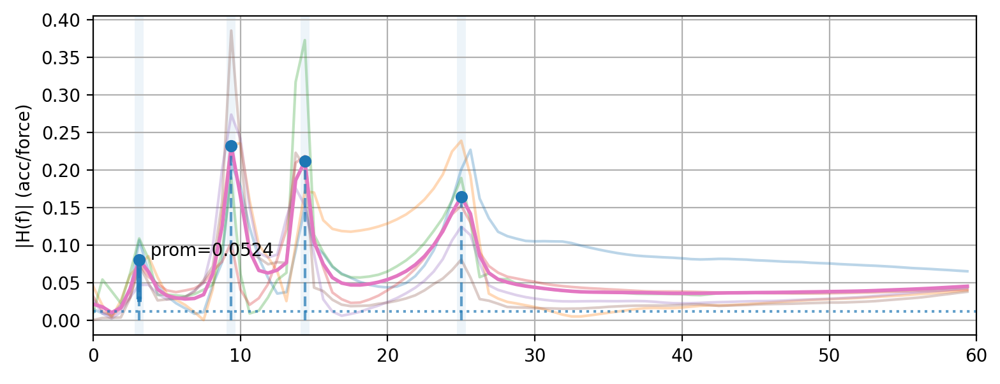
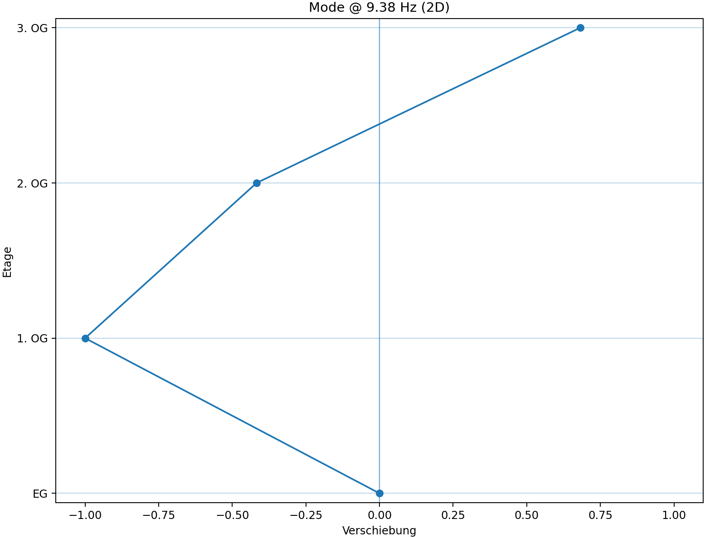
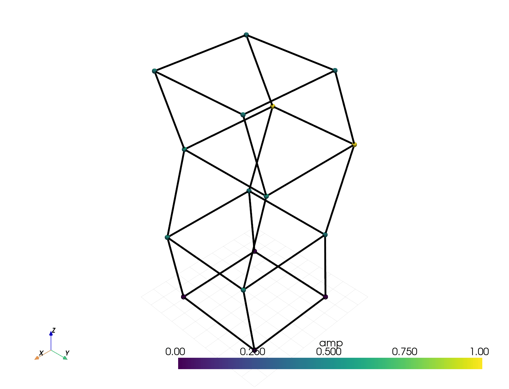

# Hochhaus Modalanalyse und Visualisierung
**Alois Schmalwieser**  
Visualization & Data Processing - Final Project

---

## Problem / Motivation
- Zeitdaten aus Prüfstandstechnik: **Kraft** + **Beschleunigung**
- Ziel: Moden extrahieren und darstellen
- Direkte verarbeitung der Zeitdaten aus Labview Messung

---

## Vorgehensweise
1. Import der 6 Messungen im Zeitbereich
2. Berechnung der FRF je Anregungspunkt mit `scipy.welch` und `scipy.csd`
3. Ermitteln der Eigenfrequenzen aus Mittelwert der 6 Knoten mit `scipy.find_peaks`
4. Participation je Anregungspunkt am Peak
5. 3D Darstellung + Export

---

## Implementation Highlights
  - Keine vohergehenden Berechnungen in Labview notwendig
  - Stabile Modeidentifikation durch Peak Picking auf dem gemittelten Betragsfrequenzgang aller FRFs
  - Bewegte 3D - Darstellung der Moden

---

## Screenshots FRFs

  

---

## 3D-Visualisierung (Stickmodell)
- 16 Knoten: 8 vorne + 8 hinten (4 Ebenen)
- Unterste Ebene Fixiert
- Grid zu bessern Veranschaulichung

---

## Screenshots 2D Darstellung - Eigenmode

  

---

## Screenshots 3D Darstellung - Eigenmode

  

---

## Export
- FRF Plot als PNG
- 3D Screenshot als PNG
- 3D Animation als GIF
- Exportpfad: `assets/screenshots/`
 
---

## Ergebnisse
 - Korrekte Ermittlung der Eigenfrequenzen
 - Verständliche Visualisierung der Moden
 - Beschränkt auf diesen einen Anwendungsfall

---

## Herausforderungen & Lösungen
 - Ermittlung der Eigenfrequenzen - ChatGTP kam auf `welch` und `csd`
 - Interpretation des von KI erstellen Codes
 - Übersicht behalten
-Nicht alles in `main.py` implementieren
 - Fehlersuche kann sehr zeitintesiv sein

---

## Lessons Learned
- ChatGPT ist sehr gut für einen "First Shot"
- ChatGPT braucht sehr genaue Angaben
- Umgang mit PyQT6 zu GUI erstellung
- Auch kleine Änderungen sofort Testen

---

## Thank You
Questions?