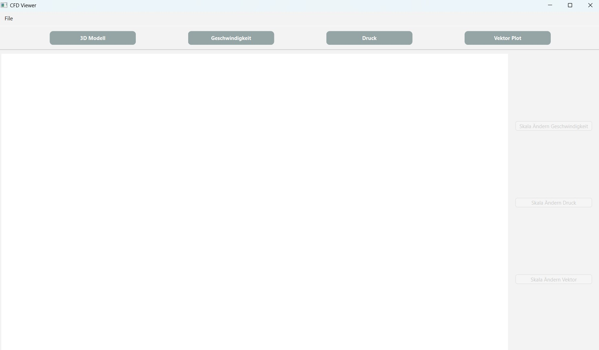
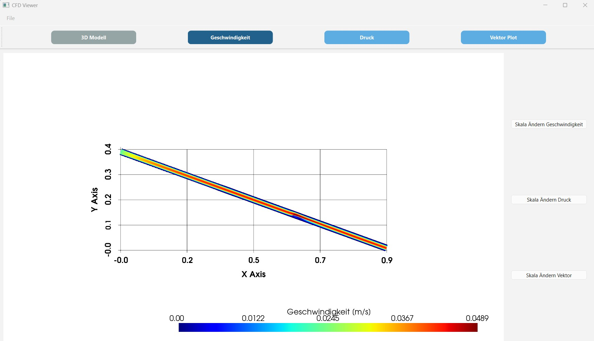
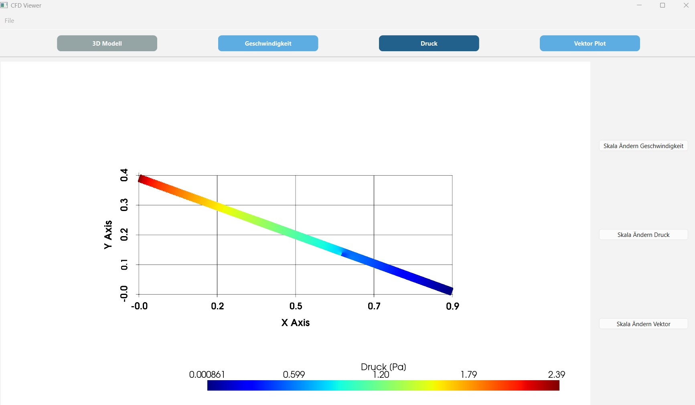
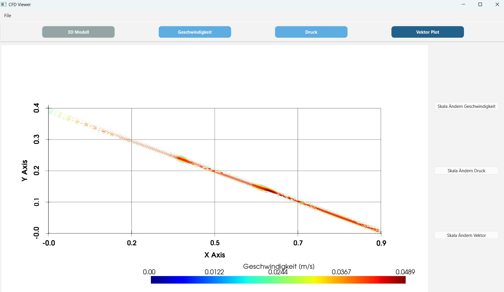
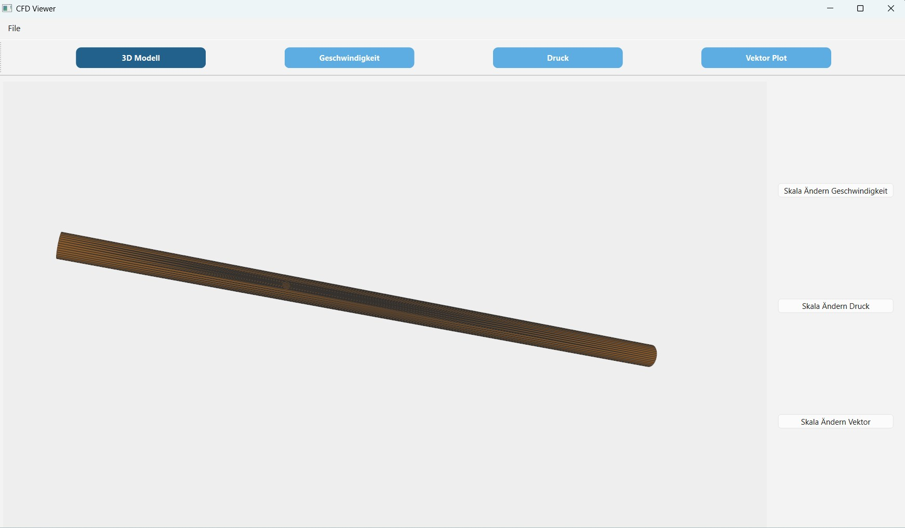

## Project Title
**CFD Results Viewer**  

## Brief Description
Dieses Projekt stellt einen interaktvien Viewer für CFD-Ergebnisse dar. Der Fokus liegt dabei auf die Anzeige der Geschwindigkeit und des Druckes. Zusätzlich wird auch ein qualitativer Vektor-Plot der Geschwindigkeit gezeigt. Dabei werden über eine CSV Datei die Daten der CFD-Simulation eingelesen. Weiters kann auch ein STL-Modell eingelesen werden und dieses wird dann in 3D-Dargestellt.
Ziel ist es, CFD-Daten anschaulich und benutzerfreundlich darzustellen, um einen schnellen Überblick über die Simulationsergebnisse zu bekommen.
---

## Features
- **CSV Import:** Hereinladen von CFD-Daten mit Spalten für X, Y, Z, Pressure und Velocity.  
- **STL Import:** Hereinladen von 3D-Modelle im STL-Format.  
- **Skalarplots:** Darstellung von Geschwindigkeit (Velocity) und Druck (Pressure) in einem Plot  
- **Vektorplots:** Visualisierung von Strömungsvektoren mit Pfeilen, skaliert nach Geschwindigkeit.  
- **3D STL Ansicht:**  3D-Anzeige des simulierten Modells
- **Benutzerdefinierte Skalen:** Skala für Velocity, Pressure oder Vector für den User anpassbar 
 

---

## Technologies Used
- **Python Libraries:**  
  - `NumPy` – numerische Berechnungen, Vektorrechnungen.  
  - `pandas` – CSV-Datenverarbeitung.  
  - `PyVista` – 3D-Visualisierung und Mesh-Handling.  
  - `PyVistaQt` – Integration von PyVista in Qt.  
  - `PyQt6` – GUI-Entwicklung (Widgets, Layouts, Dialoge).  

- **Techniken & Besonderheiten:**  
  - Vektorrichtung qualitative Strömungsrichtung  
  - Dynamisches Anpassen der Farbskala durch Benutzer.  
  
---

## Installation & Setup
- **Installations**  
  - pip install numpy
  - pip install pandas
  - pip install pyvista
  - pip install pyvistaq
  - pip install PyQt6


## Data
- **What data does it use**  
  - CSV-Datei – mit X,Y,Z Koordinaten und Geschwindigkeit und Druck  
  - STL-Datei für 3D-Modell

- **Where is sample data located**  
  - final-assignment\Christa Gattringer\code\data

- **Format/structure of expected data**  
  - CSV: X,Y,Z Geschwindigkeit, Druck


## Vektorplot-Algorithmus (CFDViewer)

- **1. Modus setzen**
  - `self.current_mode = "Vector"`
  - Buttons neu einfärben: `self.update_button_styles()`
  - Alten Plot löschen: `self.plotter.clear()`

- **2. Daten extrahieren**
  - Punkte: `points = self.df[["X", "Y", "Z"]].to_numpy()`
  - Geschwindigkeit: `velocity = self.df["Velocity"].to_numpy()`

- **3. Strömungsrichtung bestimmen**
  - Lineare Regression in XY: `slope, _ = np.polyfit(points[:,0], points[:,1], 1)`
  - Richtungsvektor: `flow_dir = np.array([1.0, slope, 0.0])`
  - Normieren: `flow_dir /= np.linalg.norm(flow_dir)`

- **4. Vektoren erstellen**
  - Vektor für jeden Punkt: `vectors = np.tile(flow_dir, (len(points), 1))`
  - PyVista-Mesh erstellen: `mesh = pv.PolyData(points)`
  - Daten zuweisen:
    - `mesh["Velocity"] = velocity`
    - `mesh["Vectors"] = vectors`
  - Aktivierte Vektoren: `mesh.set_active_vectors("Vectors")`

- **5. Stichproben (Subsampling)**
  - Nicht jeden Punkt darstellen, z.B. jeden 10.:  
  `sampled = mesh.extract_points(np.arange(0, len(points), 10))`

- **6. Pfeile generieren**
  - Richtung: `"Vectors"`
  - Skalierung: `"Velocity"`
  - Pfeil-Glyph: `pv.Arrow()`
  - Faktor: `factor=0.18`  
   `glyphs = sampled.glyph(orient="Vectors", scale="Velocity",  factor=0.18, geom=pv.Arrow())`

-**7. Plot hinzufügen**
  - Farbskala aus Benutzerdefinition: `clim = self.scalar_ranges["Vector"]`
  - Mesh hinzufügen:  
  ```python
  self.plotter.add_mesh(
      glyphs,
      scalars="Velocity",
      cmap="jet",
      clim=clim,
      scalar_bar_args={"title": "Geschwindigkeit [m/s]"}
  )
 ```

## Screenshots
- **Anfangsstatus:**
  
- **Geschwindigkeit:**
  
- **Druck:**
  
 - **Vektorplot:**
  
- **3D-Modell:**
  