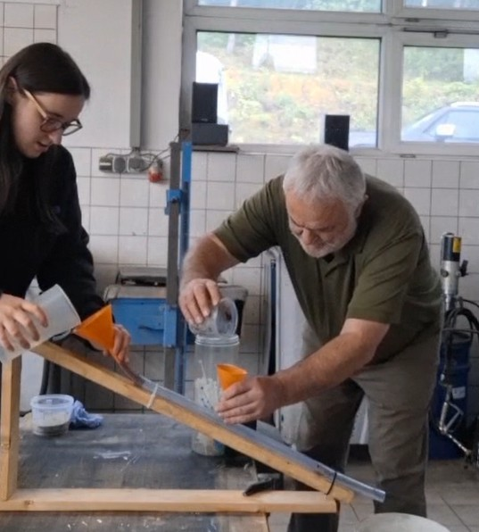
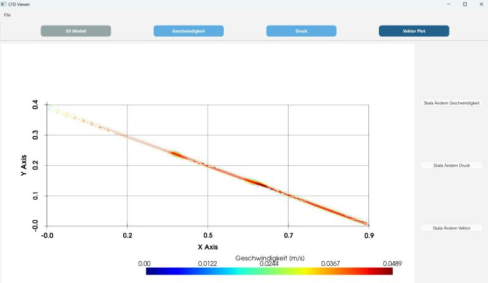

# CFD  Viewer
**Christa Gattringer**  
Visualization & Data Processing - Final Project

---

## Motivation
- Eigenes Projekt und Daten nützlich weiterverarbeiten
- Einfache Vorgang um Ergebnisse von CFD-Simulationen zu visualisieren
- Schneller Vorgang um Ergebnisse von CFD-Simulationen zu visualisieren

---
## Motivation
- 

---

## Approach
- High-level Überblick:
  - CSV-Dateien mit CFD-Daten importieren
  - STL-Modelle für Geometrie visualisieren
  - Interaktive 3D-Plots für Geschwindigkeit, Druck und Vektoren
  - Benutzerdefinierte Skalen 
- Key Technologien:
  - Python
  - PyVista
  - PyQt6
  - Numpy
  - Pandas

---

## Implementation Highlights
- **Vektorplot Algorithmus:**
  1. Punkte & Geschwindigkeiten aus CSV extrahieren
  2. Mittlere Strömungsrichtung berechnen
  3. Richtungsvektoren für jeden Punkt erstellen
  4. Subsampling: z.B. jeden 10. Punkt für Performance
  5. Pfeil proportional zur Geschwindigkeit skalieren
  6. Interaktiven 3D-Plot rendern mit Farbskala

---
## Implementation Highlights
- **Features:**
  - Interaktive Zoom- & Drehfunktionen
  - Farbskala anpassbar durch Benutzer
---
## Implementation Highlights
- **Features:**
  

---

## Demo
- Vorführung

---

## Results
- Dateneinlese von CSV-Datei und STL-Datei
- Interaktive Visualisierung
- Vektorplots zeigen qualitative Strömungsrichtungen und Geschwindigkeit
- Benutzerdefinierte Skalen verbessern Interpretation der Ergebnisse

---

## Challenges & Solutions
- **Challenge:** Große Datenmengen führten zu überfüllten Vektorplots 
  **Solution:** Ausdünnung (jeden n-ten Punkt plotten)
- **Challenge:** Richtungsvektor für homogene Pfeile bestimmen  
  **Solution:** Mittlere Strömungsrichtung XY via linearer Regression

---

## Lessons Learned
- Integration von **PyVista** in **PyQt6** ermöglicht interaktive Oberfläche für CFD-Daten
- Umgang mit großen Datensätzen durch Subsampling & Vektorisierung
- Praktische Anwendung von NumPy für Datenvorverarbeitung
- GUI-Design für wissenschaftliche Visualisierung

---

## Thank You
Questions?
