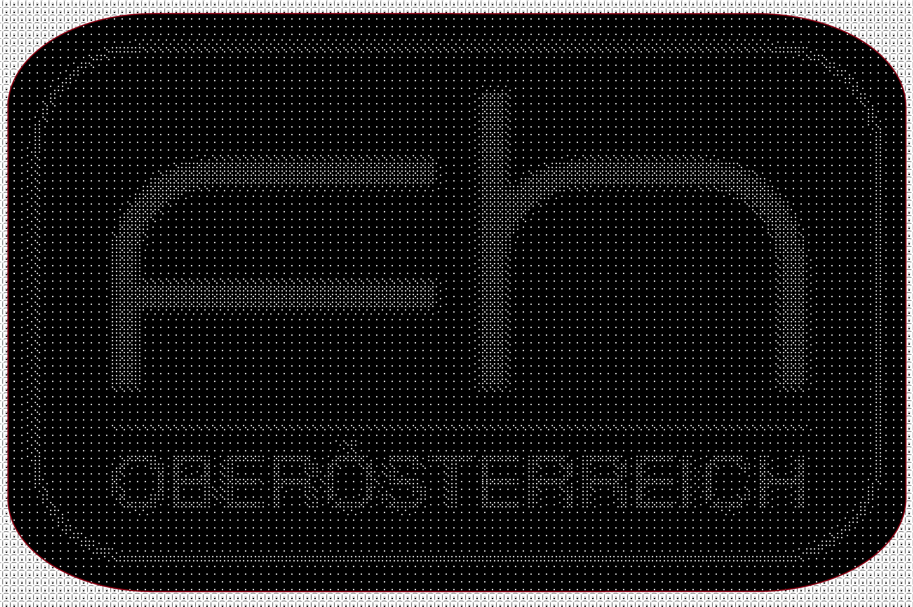
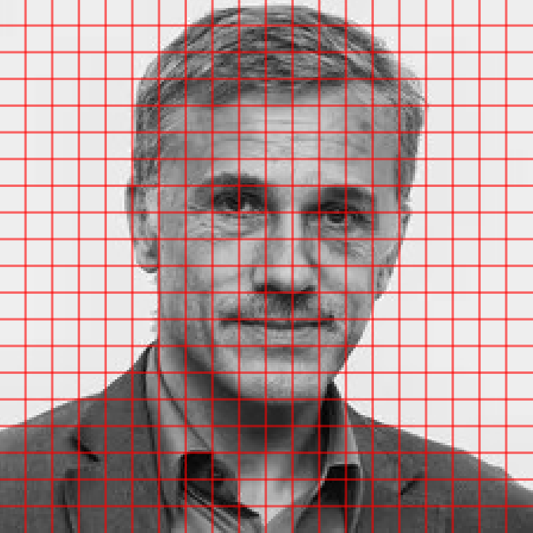
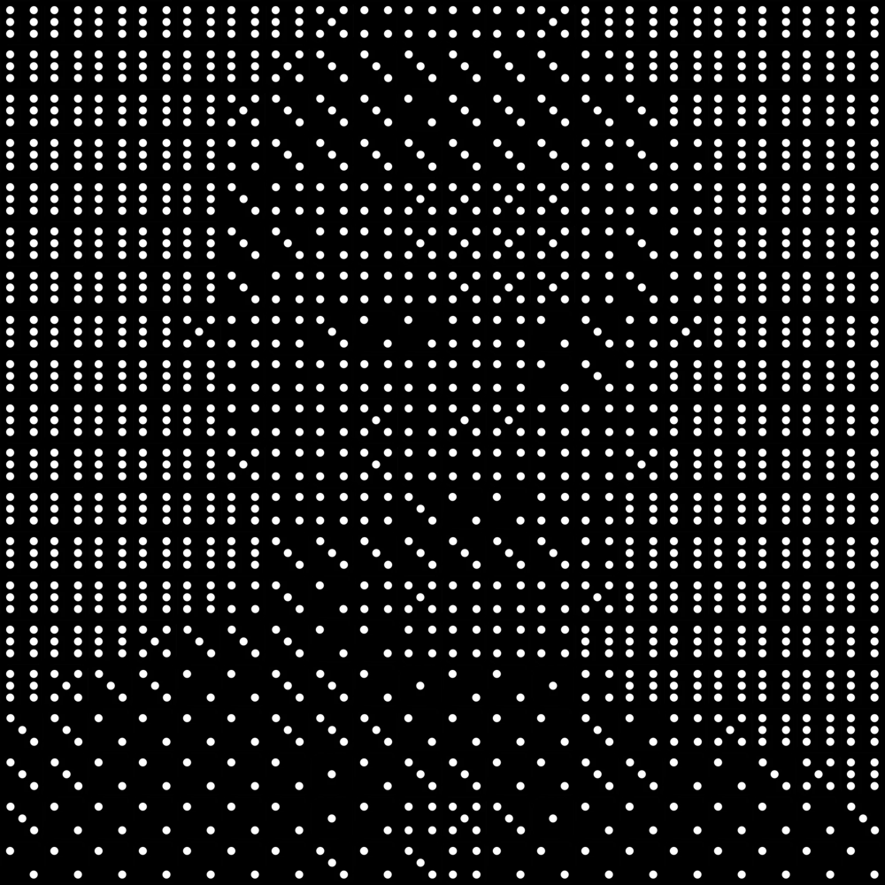
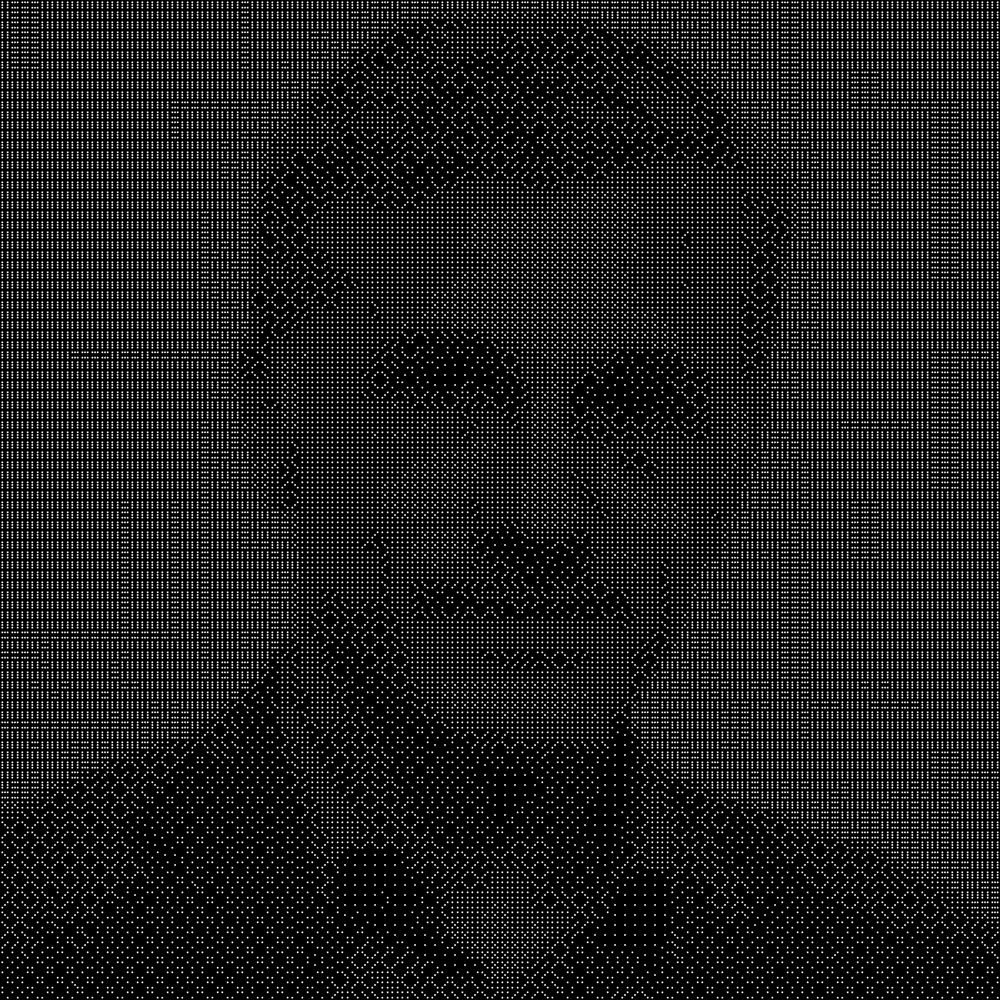
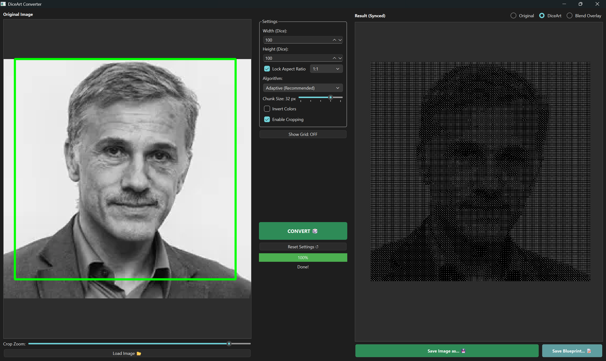

# DiceArt Converter
### Transforming Images into Physical Dice Mosaics

**Michael Gahleitner**
Final Project - Visualization & Data Processing

---

## Problem / Motivation
- **Motivation**: Converting digital images into physical mosaics using standard 6-sided board game dice.
- **Problem**: Traditional pixelation ignores local structure (edges/lines), leading to a loss of detail in faces and textures.
- **Goal**: An easy to use GUI tool that offers intuitive image navigation (zoom, pan, crop),customization settings and allows the user to exports both a visual dice image aswell as blueprints to assist real world recreation.

---

## 🛠️ Core Concept

- **Rasterization**:
  - The source image is divided into equal-sized squares based on user input (`Width/Height in Dice`).
  - Each of these squares corresponds to exactly one physical die.
- **Grayscale Calculation**:
  - The average grayscale value of all pixels contained within a sqaure is calculated.
  - The result is a single brightness value between 0 (Black) and 255 (White).
- **Dice Approximation**:
  - The brightness spectrum is mapped to 6 dice values.
  - The algorithm selects the die face (pip count) that best matches the squares's mean brightness.
---

## 🎲 Algorithm 1: Simple Mode (Brightness Mapping)
The baseline method, focusing purely on luminance.

- **Function**: Maps the average brightness of a square directly to a dice value (1–6). Dice are NOT rotationally optimized. 

| Grid (20x20)| | Simple |
| :---: | :---: | :---: |
|  | ➔ |  |

---

## 🎲 Algorithm 2: Gradient Mode (Rotational Optimization)
Treating dice as geometric shapes to approximate lines and edges.

- **The Goal**: Detect the orientation of features (like eyes, jawline or hair) and rotate the die to best fit that line.
- **Chunking**: Both grid square area and dice reference picture are discretised using a specified chunk resolution (e.g.: Chunk Size 32x32).
- **MSE Calculation**: The algorithm compares each chunk against **4 pre-rotated variants** (0°, 90°, 180°, 270°) of the target die.
- **Gradient Detection**:
    - Uses **Mean Squared Error (MSE)** to find the mathematical "best fit" 
    - By comparing pixel-by-pixel, the code identifies which rotation aligns its dots best with the identified feature of the image.

---

## Challenges & Solutions
- **Visual Noise**: Initially, slight brightness noise in smooth areas caused dice to rotate randomly, creating a chaotic "nervous" and unnatural looking dice art picture.
    - **Solution**: Implementing the **Adaptive Algorithm** with variance thresholding to ignore insignificant gradients.

     

    **Example on next slide ➔**

---

## Visual Noise Example

| Gradient | | Adaptive |
| :---: | :---: | :---: |
|  | ➔ |  |

---

## 🎲 Algorithm 3: Adaptive Mode (Recommended)
A sophisticated approach to prevent "visual noise" in homogenius areas.

- **Statistical Measure**: The code calculates the **Standard Deviation ($\sigma$)** of the chunk's pixels.
- **The Decision Logic**:
    - **Low Variance**: The area is "smooth" (sky, skin). The code stays with **Simple Mode** (North orientation) to keep the area homogeneous.
    - **High Variance**: The area contains an edge. **Rotational Optimization** is triggered.
- **Significance Check**: A rotation is only used if it improves the MSE by **>15%** over the base orientation.

---
## GUI

---

## Demo: Christopher Waltz (Adaptive Algorithm)

| Original | | DiceArt (100x100) |
| :---: | :---: | :---: |
|  | ➔ |  |

---

## Demo: Toto Wolff (Adaptive Algorithm)

| Original | | DiceArt (100x100) |
| :---: | :---: | :---: |
|  | ➔ |  |

---

## Lessons Learned
- **Perceptual Computing**: What is mathematically "correct" or "optimal" isn't always what looks best to the human eye (hence the need for the Adaptive algorithm).
- **Asynchronous Design**: Using signals and slots to separate backend data processing from visual representation.

---

## Thank You

**Michael Gahleitner**
*DiceArt Converter*