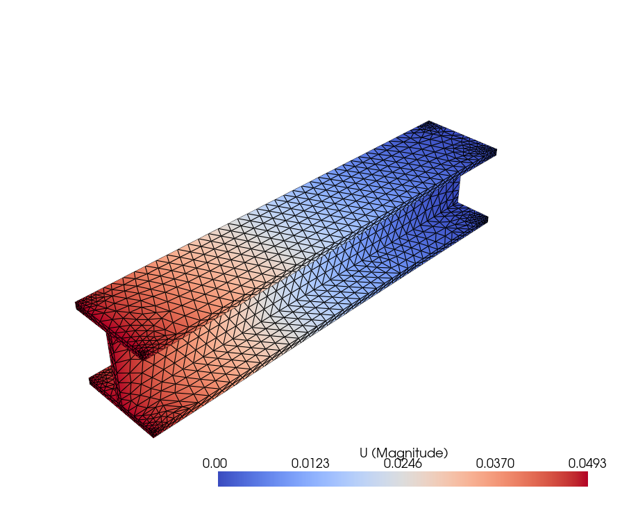
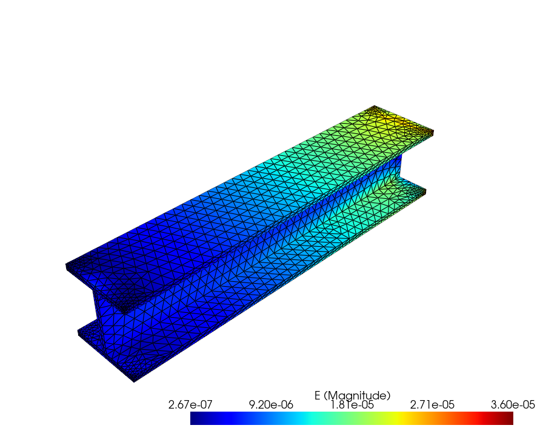
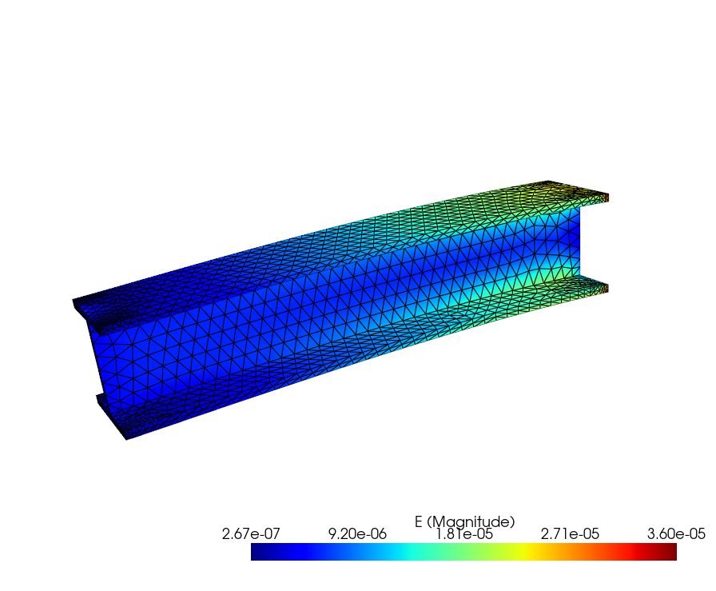
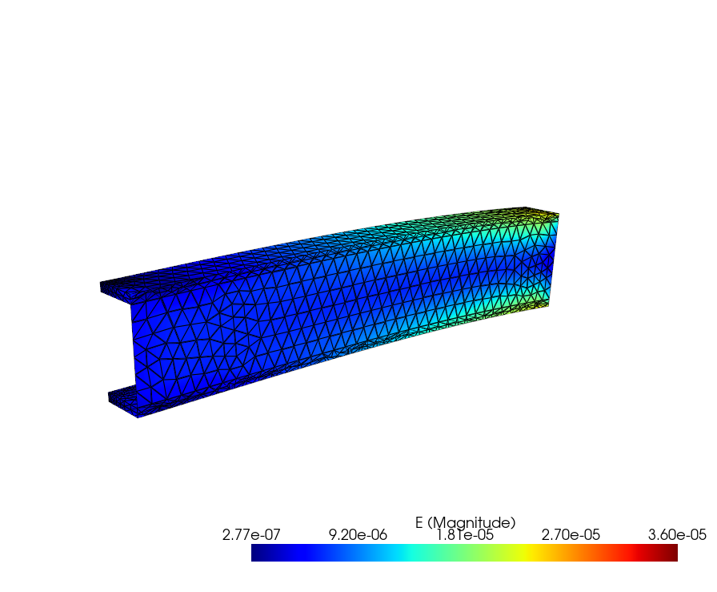
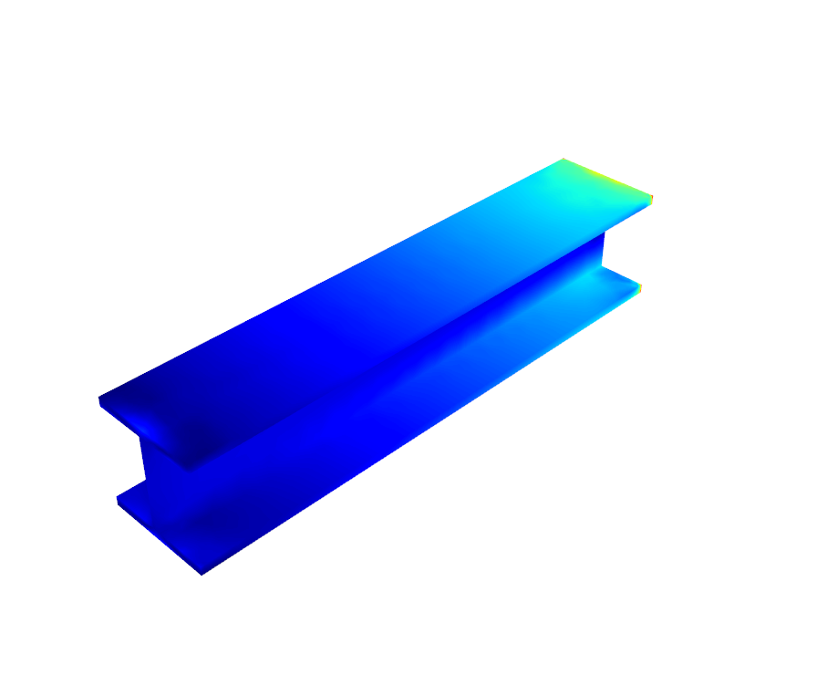
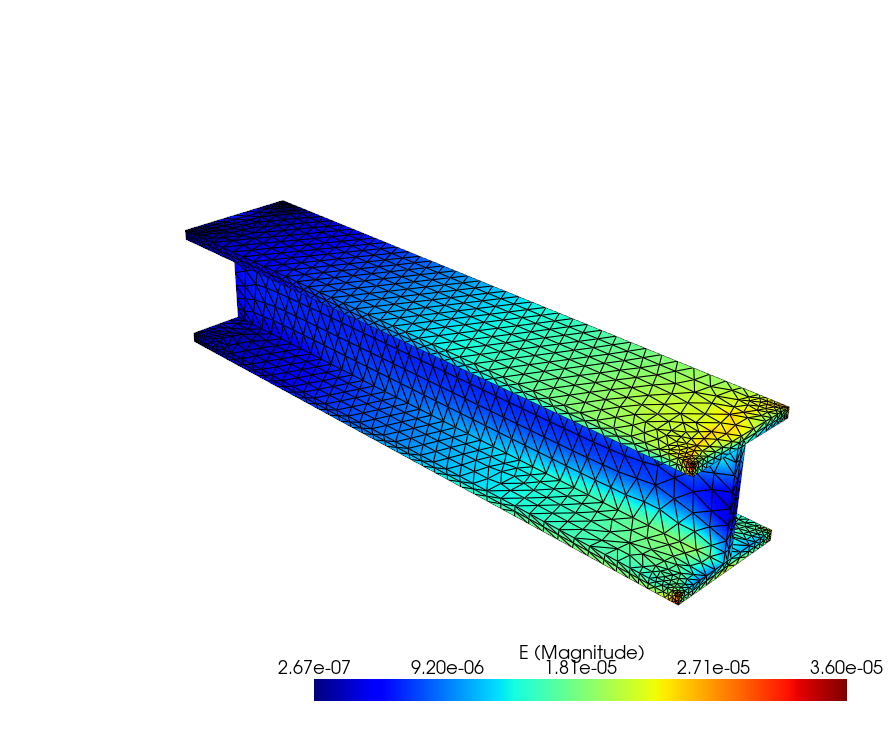

### VIS3 Aschlussprojekt

---

### Projekttitel: Bau eines FEM-Viewer
Mein Projekt ist die Weiterentwicklung der Aufgabe aus der Lehrveranstaltung und ist im Grunde genommen eine einfache Desktop-Anwendung zur Visualisierung von Ergebnissen im Bereich der FEM. Mein Programm ermöglicht es, verschiedene FEM-Meshs aus abgespeicherten Datei-Typen herein zu laden und durch verschiedene Einstellungen wie Spannungen oder von-Mises-Spannungen, Deformationen und Schnitte in meinem Beispiel den Balken, darstellen zu lassen.
Ich selbst fand es interessant Daten mit meinem FEM-Viewer einzulesen und verschiedenste grafische Darstellungen wie eben Verformungen, Spannungsverteilungen usw. darzustellen und diese zu visualiseren, das man sich auch etwas vorstellen kann.
Mein Fokus bei dieser Aufgabe ist dabei auf der Funktionalität gelegen.

---

### Features
- Laden von FEM-Meshs aus .vtu, .vtk, .vti Dateien möglich
- Auswahl verschiedener Anzeigemöglichkeiten wie U,S, S_Mises usw.
- Darstellung der Verformung welches man mit einem Verschieberegeler selbst steuern kann
- Die Integrierung der zweiten Challenge Clipping Plane  wo man entlang x,y,z Achse schneiden kann, kann selbst eingestellt werden
- Ein- und Ausblenden von Kanten
- Ein- und Ausblenden von der Skalierung wo man die Werte zur anzeigenden Farbe ablesen kann
- Auswahl verschiedener Colormaps
- Erstellen von Screenshots der aktuellen Ansicht
- Einfache Benutzeroberfläche

---

### Verwendete Technologien
- **Python**      wurde die Version 3.13.10 verwendet
- **PyVista**     für die 3D Visualisierung
- **PyVistaQt**
- **PyQt6**       für die Benutzeroberfläche
- **NumPy**       für die Berechnung von Beträgen und Vektoroperationen

---

### Daten
Welche Dateiformate sind beim einlesen der Mesh-Datei zum Verwenden möglich: .vtu, .vtk, .vti
Wo befinden sich die Daten am PC: visdat-course/data/beam_stress.vtu
Erwartete Datenstruktur:
-Punktbasierte Ergebnisfelder
-Verschiebungsfeld meist mit dem Namen U
-Spannungsfelder wie S oder S_MISES

---

### Implemetierungsdetails
Die Benutzeroberfläche ist mit PyQt6 umgesetzt worden. Grundsätzlich sind alle Regler und Buttons zum Einstellen links seitlich platziert worden und rechts folgt die visuelle Darstellung in der 3D-Ansicht mit PyVista. Die Vektorfelder werden automatisch in Betrag umgerechnet mit NumPy. Die Deformation wird durch Verschieben des Schiebereglers mit einer Skalar wo man sieht um wieviel man den Effekt verstärkt umgesetzt. Die Original-Mesh Datei wird gespeichert, um die Deformation zurücksetzen zu können. Als nächstes Feature gibt es den Button "Clipping", dieser wird über die clip-Funktion von PyVista umgesetzt. Ein Hauptaugenmerk wurde darauf gelegt das eben die Benutzeroberfläche einfach und das Programm beim öffnen von der Mesh Datei nicht abstürzt und dann schließt.

---

### Screenshot: Öffnen der Mesh-Datei

---

### Screenshot: Anzeigen der Color_Map

---

### Screenshot: Deformation auf Faktor 1000 gestellt

---

### Screenshot: Deformation auf Faktor 1000 gestelltund in y-geschnitten

---

### Screenshot: Keine Color Map und keine Scalarbar

---

### Screenshot: Nach der Deformation und Clipping anzeige wieder Resettet

---

### Zukünftige Verbesserungen
Mehrere Ansichten für einen besseren Vergleich, welche in Challenge-3 zu erledigen wären, zu implementiren. Diese Challenge konnte ich aufgrund von ständigen Programmabstürzen nicht in die Abgabedatei packen.
Vielleicht auch Animationen und Simulationen einzufügen die aufgenommen und später abgespielt werden können.
Export von Animationen und Simulationen als .mp4 Datei möglich?