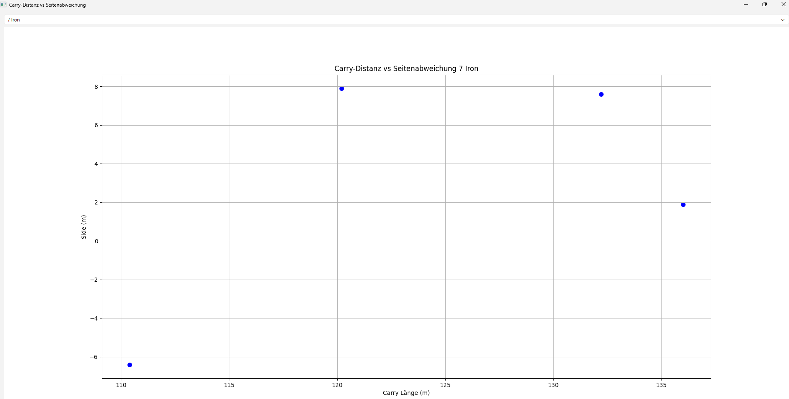
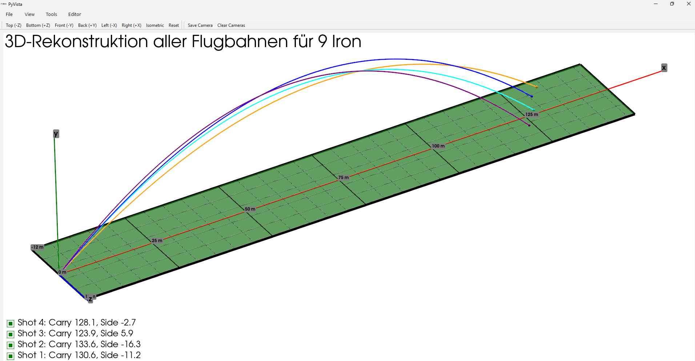

# Visualisierungen und Rekonstruktionen von Gollfballflugbahnen
**Moritz Zierler**
Visualization & Data Processing - Final Project

---

## Problem / Motivation
- What problem are you solving?
- Im Golftraining => durch radarunterstützte Messtechnik werden
jede Menge Daten erhoben und die Flugbahn dargestellt bzw. visualisiert (aber teure Produkte und Software)
- Günstigere Produkte => weniger Daten erhoben und keine Flugbahnvisualisierung
- Why is this project useful?
- Trotz weniger Daten => Visualisierung der Flugbahn möglich (durch Rekonstruktion aus "echten" Daten)
- Einfacher Vorgang zum simplen Visualisieren der Flugbahnen bestimmter Daten (Genauigkeit der Flugbahn: sehr vereinfacht und rudimentär)

---

## Approach
- Alle nachfolgenden Programme sind einzeln (getrennt) lauffähig!
- in verschiedene Entwicklungsstufen und Programme gegliedert
    - zuerst Erzeugung und Visualisierung (mit etlichen 2D Features) einer "willkürlichen" Flugbahn
    - zweiter Schritt: Erweitung auf 8 Flugbahnen (weniger 2D Features; dafür Checkboxen in 3D Visualiserung)
    - dritter Schritt: Einlesen von Daten (8 unterschiedliche Schläge und 2 unterschiedliche Schläger) => können nach Schläger gruppiert werden
    - "Kombination" der unteren beiden Programme
        1.) Einlesen von Daten 
        2.) Diese dienen als Anfangsbedingungen zur Flugbahnrekonstruktion (mathematisches Modell: in Abgabe(Screenshots)enthalten)

---

## Implementation Highlights - Daten einlesen

---

## Implementation Highlights - Flugbahnrekonstruktion

---

## Demo
Live demonstration (während der Präsentation)

---

## Results
- What works well:
- Simulationen mit einem und 8 Schlägen funktioniert ok (nicht ganz optimal)
    - mathematische Modell nur Näherung bzw. sicherlich nicht optimal
    - Korrekturfaktoren für die Weite (X-Richtung) und die Höhe (Y-Richtung) um auf die "tatsächlichen" Distanzen (laut persönlichen Erfahrung und Wissen) zu kommen
- Daten einlesen funktioniert gut 
- Rekonstruktionen der Flugbahnen funktioniert auch gut (Hinblick auf Funktion)
- Performance:
- Rekonstruktionen der Flugbahnen hinschtlich Performance nicht optimal
    - Benötigt bereits einige Sekunden => für noch mehr Flugbahnen wahrscheinlich nicht mehr geeignet

---

## Challenges & Solutions
- What was difficult:
- Die Vorstellungen (Gedanken, Bilder) so abändern bzw. in "Code umsetzen", dass es diesen Vorstellungen entspricht
- "In den Programmierablauf hineindenken" bzw. Programmiererdenken entwickeln
- How you overcame it:
- Vorher sehr gut überlegen => Struktur, Aufbau, Herangehensweise, etc.
- Planung, Ablauf erstellen und Projekt in Teilaufgaben unterteilen.

---

## Lessons Learned
- What you learned from this project:
- Auch ich kann in gewissem Maß programmieren bzw. Programieraufgaben lösen :)
- Kleine Abschnitte bzw. Schritte => bessere Kontrolle und Effizienz
- Genau und sauber Arbeiten
- Skills you developed:
- Programmieraufgaben so aufteilen bzw. zerlegen, dass "Kleinprojekte" entstehen
- Diese Kleinprojekte entwickeln und extra testen
- Mit Hilfe der KI ein komplexeres Projekt zu erarbeiten
- Fehlersuche teilweise verzwickt

---

## Thank You
Questions?