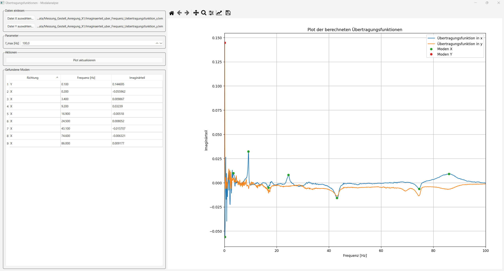

# Moden Visualisierung
Marco Hutterer

## Kurzbeschreibung

Dieses Projekt zielt daruaf ab Übertragungsfunktionen zu visualisieren. Diese Übertragungsfunktionen wurden zuvor messtechnisch im Labor erfasst und genauer gesagt handelt es sich bei diesem Beispiel um einen Rollenprüfstand für ein Modellauto.

Hier wurde eine Modalanlyse durchgeführt und jeweils die Beschleunigungen erfasst. Diese wurden mittels LabVIEW schon auf Übertragungsfunktionen umgerechnet, welche auf der y-Achse den Imaginärteil der Amplitude und auf der x-Achse die Frequenz aufgetragenm haben.

Dieses Python Programm lest diese Übertragungsfunktionen ein und sucht weiters noch die Peaks heraus, welche die Moden darstellen. Anschließend werden die Übertragungsfunktionen in einem Plot ausgegben.

## Features

Die Features dieses Projekts sind zum einen das Visualisieren von Übertragungsfunktionen und das gleichzeitige finden von Moden. Weiters werden diese Moden noch in einer Tabelle im graphischen INterface dargestellt.

Zudem ist es möglich im Fenster der geplotteten Übertragungsfunktionen hinein zu zoomen und somit diese genauer zu betrachten.

Weiters ist es im graphischen Interface möglich neue Übertrgaungsfunktionen in x und y einzulesen und zusätzlich kann man noch die maximal dargestellte Frequenz ändern.

## Technologies Uses
- **Python**
- **NumPy / Pandas**
  - Datenverarbeitung
  - Numerische Operationen
- **SciPy (`find_peaks`)**
  - Robuste Peak- / Modenerkennung
- **Matplotlib**
  - Plotten der Übertragungsfunktionen
- **PyQt6**
  - Graphisches User Interface
  - Interaktive Bedienung

## Installation & Setup
```bash
cd final-assignment/hutterer/code
pip install -r requirements.txt  # nur SciPy ist neu dabei
```
## Usage
```bash
python main-mit-QT.py
```
## Data
Die Daten wurden wie schon zuvor erwähnt messtechnisch im Prüftsnadslabor erfasst. Bei diesen Daten handelt es sich um die Übertragungsfunktionen vom Rollenprüstand. Hierbei gibt es immer die Übertragungsfunktion in x und y. Dies kommt daher, das das Gestell in eine Richtung durch einen Hammer angeregt wurde und dann die Beschleunigungen an unterschiedlcihen Stellen in x und y gemessen wurden.

## Implementation Details
Anfangs war das korrekte einlesen der Messdaten schwierig, was allerdings dadurch gelöst wurde, dass die Daten auf das gleiche Format gebracht worden sind. Weiters war es eine Herausforderung wie man die Moden herausfindet. Dies wurde durch die `find_peaks` Funktion durchgeführt. In dieser habe ich eine "Prominence" Faktor definieren müssen, welcher definiert, wie "deutlich" dieser Peak bzw. Mode sein muss.

Demanch muss der Benutzer, wenn er das Programm startet Übertragungsfunktionen auswählen. Es sind schon zuvor ausgewählte Übertrgaungsfunktionen implementiert, sodass schon etwas angezeigt wird. Anzumerken ist, dass immer 2 Übertragungsfunktionen eingelesen werden müssen also eine in x und eine y, sonst gibt das Programm eine Fehlermeldung aus.

## Screenshots



## Future Improvements
- Berechnung der Übertragungsfunktion direkt in Python
- Darstellen aller Übertrgaungsfunktionen in einem Diagramm
- Animieren des Gestells bezüglich der Moden