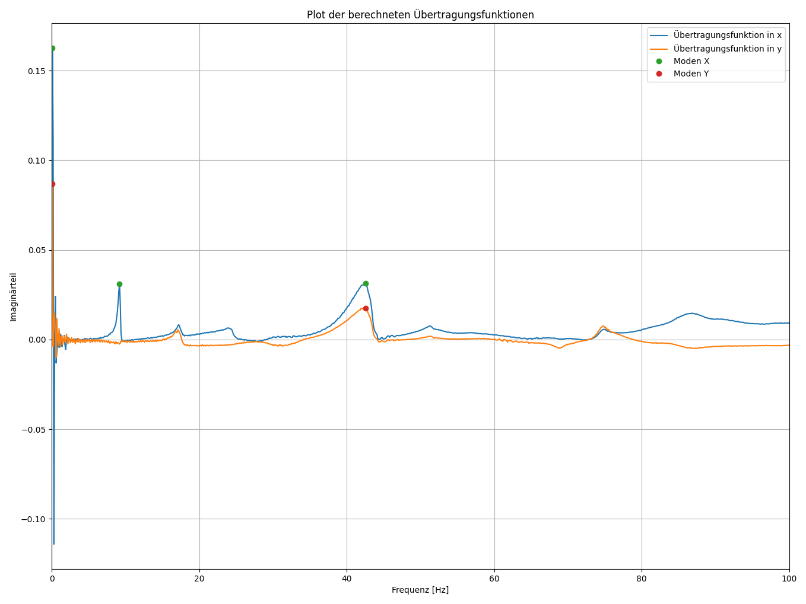

# Visualisierung einer Üertragungsfunktion und Darstellen der Moden
**Marco Hutterer**
Visualization & Data Processing - Final Project

---

## Problem / Motivation
- Durchführung einer **Modalanalyse an einem Rollenprüfstand**
- Messung von Systemantworten in **X- und Y-Richtung**
- Bereits berechnete **Übertragungsfunktionen** liegen vor  
  → dargestellt als **Imaginärteil über der Frequenz**
- Ziel:
  - Moden (Eigenfrequenzen) **identifizieren**
  - Ergebnisse **visualisieren**
  - Moden **numerisch auswertbar** darstellen in einer Tabelle

---

## Vorgehensweise
1. Einlesen der Messdaten (X / Y)
2. Skalierung und Filterung der Frequenzen
3. Berechnung des Betrags der Übertragungsfunktion
4. Peak-Erkennung zur Modenbestimmung
5. Visualisierung:
   - Übertragungsfunktionen
   - Markierung der Moden
6. Ausgabe der Moden in Tabellenform

---

## Verwendete Pakete
- **Python**
- **NumPy / Pandas**
  - Datenverarbeitung
  - Numerische Operationen
- **SciPy (`find_peaks`)**
  - Robuste Peak- / Modenerkennung
- **Matplotlib**
  - Plotten der Übertragungsfunktionen
- **PyQt6**
  - Graphisches User Interface
  - Interaktive Bedienung

---

## Implementierungs Highlights

- Erkennung der Moden und nicht jedes Peaks
- Darstellen der Moden im GUI
- Darstellen der Moden in einer Tabelle (links)
- Kontrollpanel links, GUI rechts

---

## Demo Foto

---

## Fazit

- Erfolgreiche Umsetzung einer **Modalanalyse-Visualisierung**
- Kombination aus:
  - Numerischer Auswertung
  - Interaktiver Darstellung
- Tool ist:
  - Verständlich
  - Erweiterbar
  - Praktisch für experimentelle Auswertung

---

## Lessons Learned

- Python ist eine gute alternative zu Excel/Matlab
- Diagramme sind einfacher aufzubereiten als mit anderen Programmen
- KI unterstützt gut, aber nur mit sehr genauen Angaben
- Stellenweise einfacher zu bedienen als z.B.

---

## Thank You
**Vielen Dank für Ihre Aufmerksamkeit!** 
Fragen?