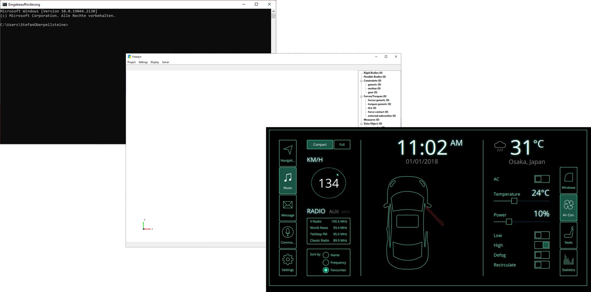
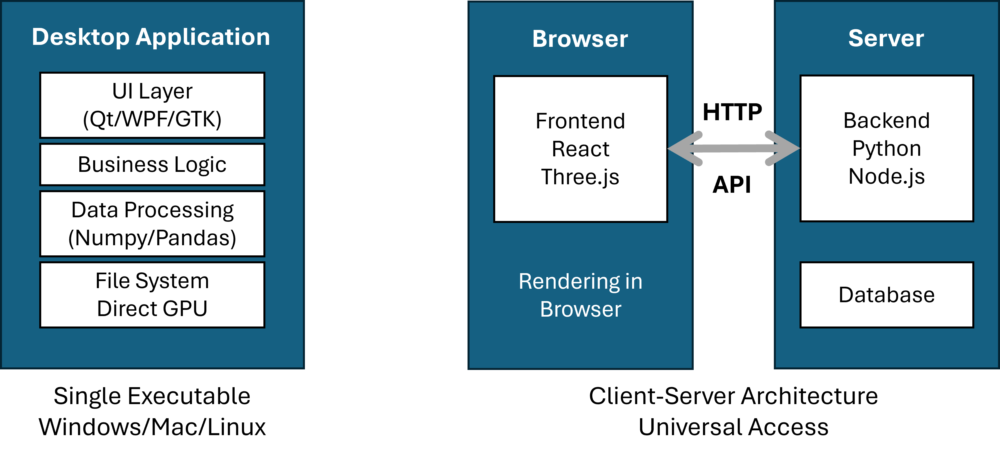
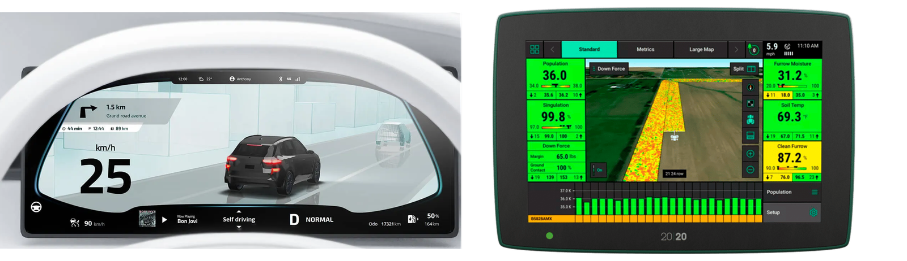

<!-- _class: title -->

# User Interfaces

## Turning your script into a tool somebody else can use

Lecture 4 · Qt, PyQt6, PyVista

<!--
Three blocks. The first is short on purpose: the interesting part is blocks two
and three, where they build something. The Qt workshop on the site is the
homework and picks up exactly where block three stops.
-->

---

# Today

1. **Why an interface at all**, and desktop against web
2. **PyQt6**: windows, layouts, signals and slots, the event loop
3. **PyVista in Qt**: the 3D view inside your own window

<p class="note">Hands on afterwards: the Qt workshop on the course site, building an FEM viewer.</p>

---

<!-- _class: ask -->

# Your viewer script works perfectly. Your colleague still cannot use it. Why?

<!--
Answers: they have no Python, they do not know which file to edit, they do not
know what to change, they broke it. All correct. A user interface is not
decoration, it is the difference between a script and a tool.
-->

---

# What an interface actually buys

<div class="boxes">
<div><b>Reach</b>People who know the domain but not the language can use your work.</div>
<div><b>Speed</b>Change a parameter and see the result, instead of editing and rerunning.</div>
<div><b>Safety</b>The interface only offers what is valid, so fewer wrong inputs reach the code.</div>
</div>

<p class="note">The first internal tool you write at a company is usually a small window around a script that already worked.</p>

---

# Where this comes from



From batch jobs on a mainframe, through the desktop era and native CAD, to the
browser. Engineering software sat on the desktop the whole time, for one reason:
performance on large models.

---

# Desktop and web are different architectures



<p class="note">Desktop: one process, direct access to the GPU. Web: a browser, a server, and a connection in between.</p>

---

# Which one, when

<div class="cols">
<div>

**Desktop**

Millions of cells, maximum rendering performance, offline, access to CAD files
and hardware.

ParaView, MATLAB, every CAD system.

</div>
<div>

**Web**

Many occasional users, sharing and review, no installation, central deployment.

Dash, Streamlit, result viewers for a team.

</div>
</div>

> In practice both: the desktop tool for the person doing the work, a web view
> for everyone who only needs to look.

---

<!-- _class: section -->

# PyQt6

## The framework behind most engineering software you know

---

# You have used Qt all day without noticing



ParaView, Maya, VLC, Audacity, the dashboard in a car, the terminal on an
agricultural machine. Qt has been in production for over thirty years, it is
genuinely cross platform, and it talks to OpenGL directly.

---

# PyQt6 or PySide6

<div class="cols">
<div>

**PyQt6**

GPL or commercial licence. What we use here.

</div>
<div>

**PySide6**

The Qt Company's own bindings, LGPL.

</div>
</div>

The APIs are close to identical. Code written against one usually runs against
the other after changing the import.

```bash
pip install PyQt6 pyvistaqt
```

<p class="note">PyVista already opens its windows through Qt. You have been using it since the visualization block.</p>

---

<!-- _class: live -->

# The smallest application that works

```python
from PyQt6.QtWidgets import QApplication, QWidget

app = QApplication([])          # 1. the application object

window = QWidget()              # 2. a window
window.setWindowTitle("First Qt App")
window.resize(400, 300)

window.show()                   # 3. show it
app.exec()                      # 4. hand control to the event loop
```

<!--
Type and run it. Then delete app.exec() and run again: the window flashes and
disappears. That single experiment explains the event loop better than a
paragraph.
-->

---

# Layouts, not coordinates

```python
layout = QVBoxLayout()
layout.addWidget(QLabel("Enter name:"))
layout.addWidget(QLineEdit())
layout.addWidget(QPushButton("Submit"))
window.setLayout(layout)
```

`QVBoxLayout`, `QHBoxLayout`, `QGridLayout`, `QFormLayout`

> Never position a widget by pixel. A layout survives a resize, a different
> font size, a different operating system and a different screen. Fixed
> coordinates survive none of those.

---

# Signals and slots

```python
button = QPushButton("Load mesh")
button.clicked.connect(self.open_file)      # signal → slot

slider.valueChanged.connect(self.update_scale)
combo.currentTextChanged.connect(self.set_field)
```

<div class="boxes">
<div><b>Signal</b>Something happened. The widget announces it and does not care who listens.</div>
<div><b>Slot</b>A function that reacts. It does not care who called it.</div>
<div><b>Connection</b>Made at runtime, can be undone, can be many to many.</div>
</div>

<p class="note">This is what keeps the interface and the computation separable, and therefore testable.</p>

---

<!-- _class: ask -->

# You load a 200 MB mesh and the whole window freezes for five seconds. What happened?

<!--
The answer is the event loop: your function is running inside it, so nothing
gets repainted until you return. Let them arrive at it. Then the rule: anything
slow belongs in a QThread, and they will meet this in the final project.
-->

---

# The event loop

```python
app.exec()          # from here on, Qt waits for events
print("closed")     # runs only after the last window closes
```

1. Wait for an event: click, key, timer, signal
2. Send it to the connected slot
3. Repaint what changed
4. Repeat

> Your code runs **inside** this loop. While your function is busy, nothing is
> repainted. That is the freeze, and `QThread` is the answer.

---

# QMainWindow gives you the frame

```python
class MainWindow(QMainWindow):
    def __init__(self):
        super().__init__()
        self.setWindowTitle("FEM Viewer")

        central = QWidget()                 # the central widget is mandatory
        self.setCentralWidget(central)

        file_menu = self.menuBar().addMenu("&File")
        open_action = QAction("&Open...", self)
        open_action.triggered.connect(self.open_mesh)
        file_menu.addAction(open_action)
```

Menu bar, tool bar, status bar and dock widgets come with it.

---

# Parent and child

```python
button = QPushButton("Click", parent=window)
```

Every widget has a parent, and deleting the parent deletes its children. The
tree of widgets is also the tree that manages the memory.

<p class="note">This is why Qt code rarely deletes anything by hand, and why a widget without a parent tends to disappear unexpectedly.</p>

---

<!-- _class: section -->

# PyVista inside Qt

## The 3D view in your own window

---

# QtInteractor

```python
from pyvistaqt import QtInteractor

class MainWindow(QMainWindow):
    def __init__(self):
        super().__init__()
        central = QWidget()
        self.setCentralWidget(central)
        layout = QVBoxLayout(central)

        self.plotter = QtInteractor(central)     # a PyVista plotter as a widget
        layout.addWidget(self.plotter.interactor)

        self.plotter.add_mesh(pv.Sphere(), color="lightblue")
```

The plotter you already know, this time as a widget you can place anywhere.

---

# Always clean up

```python
def closeEvent(self, event):
    if self.plotter:
        self.plotter.close()
        self.plotter = None
    event.accept()
```

VTK holds resources that Qt knows nothing about. Without this you get a wall of
error messages on exit. They are harmless, and they make your tool look broken
to whoever is using it.

---

# Controls beside the view

```python
main_layout = QHBoxLayout()

controls = QGroupBox("Controls")            # left: the panel
controls_layout = QVBoxLayout(controls)
slider = QSlider(Qt.Orientation.Horizontal)
slider.setRange(5, 100)
slider.valueChanged.connect(self.update_mesh)
controls_layout.addWidget(slider)

main_layout.addWidget(controls)
main_layout.addWidget(self.plotter.interactor, stretch=3)   # right: the 3D view
```

<p class="note"><code>stretch</code> decides who gets the space when the window grows.</p>

---

<!-- _class: live -->

# Make the slider do something

```python
def update_mesh(self, value):
    self.mesh = pv.Sphere(theta_resolution=value, phi_resolution=value)
    self.plotter.clear()
    self.plotter.add_mesh(self.mesh, color="lightblue", show_edges=True)
    self.plotter.reset_camera()
```

Drag the slider and watch the sphere change. Then drag it fast.

<!--
Dragging fast shows the flicker and the cost of clear() plus add_mesh() on every
event. That sets up the next slide, and it is a much better motivation than
stating the rule first.
-->

---

# Updating geometry without the flicker

<div class="cols">
<div>

**Rebuild**

```python
self.plotter.clear()
self.plotter.add_mesh(...)
```

New field, new mesh, new scalar bar.

</div>
<div>

**Move the points**

```python
self.mesh.points = new_points
self.plotter.render()
```

Same mesh, different shape. Animations.

</div>
</div>

<p class="note">The second keeps the scalar bar and the camera, so nothing jumps while an animation runs.</p>

---

# Recap

- An interface makes a script into something **another person** can operate
- **Layouts**, never coordinates
- **Signals and slots** keep interface and computation apart
- Your code runs **inside the event loop**, so slow work freezes the window
- **QtInteractor** puts the PyVista view into your own window, and it needs
  cleaning up

---

<!-- _class: section -->

# Next

## Qt workshop

<p>Build an FEM viewer: file dialog, field selection, deformation, screenshot export.</p>

<p>Course site → User Interfaces → Qt Workshop</p>
