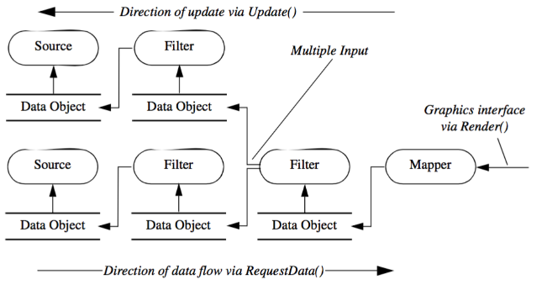
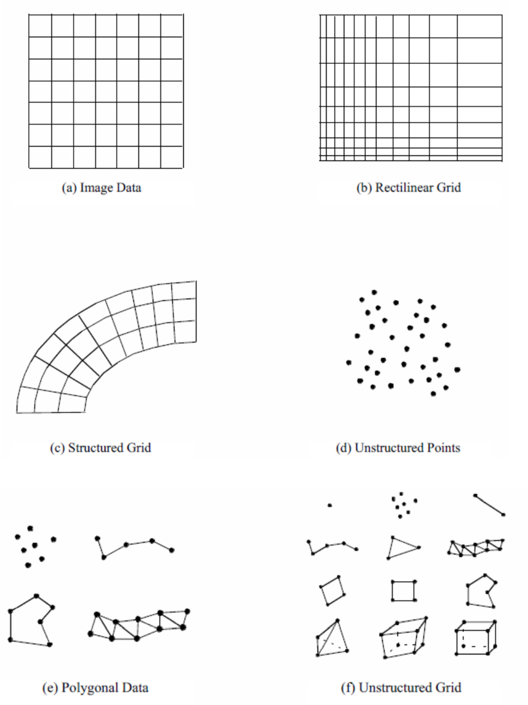
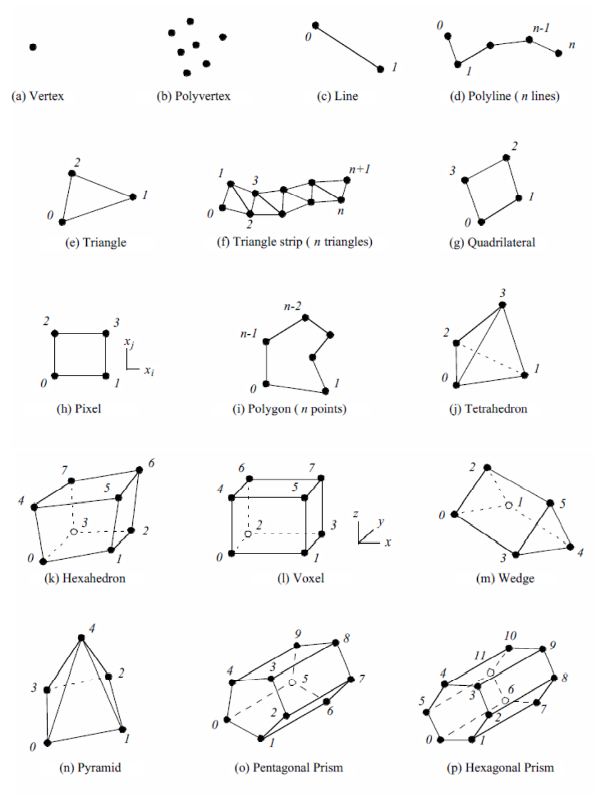
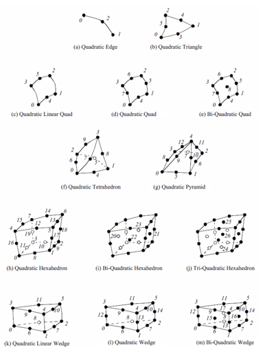
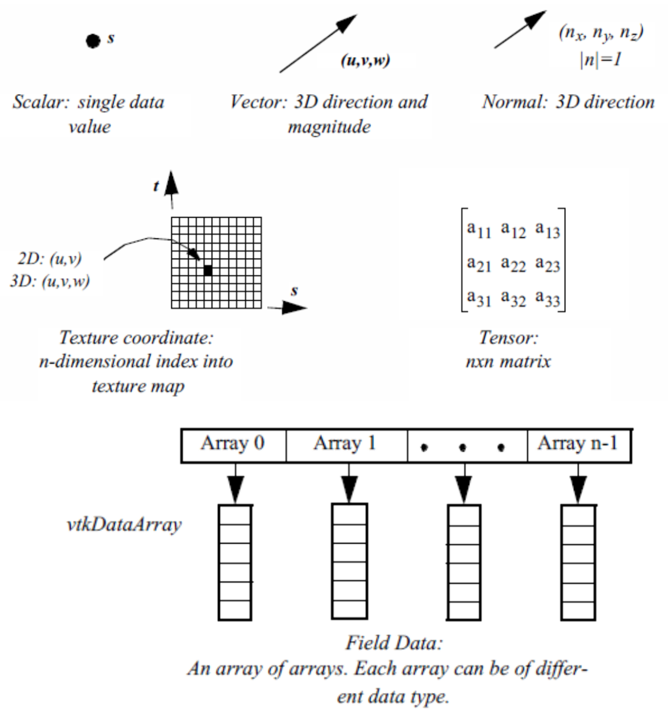

<!-- _class: title -->

# Visualization

## From a table of numbers to a picture someone can act on

Lectures 6 and 7 · Matplotlib, VTK, meshio, PyVista

<!--
Two sessions: first 2D with matplotlib, then 3D with the VTK family.
Everything shown here is in the script, so nobody has to copy code from the
screen. What is not in the script is the reasoning, and that is what the
lecture is for.
-->

---

# Today

1. **2D**: the structure behind every matplotlib figure, and how to choose a plot
2. **Colour and honesty**: why the default stress plot misleads you
3. **3D**: VTK, meshio and PyVista, and which one to reach for
4. **Live**: from `motorcycle_ride.csv` and `beam_stress.vtu` to a figure

<p class="note">Script: Visualization chapter. Data: <code>data/</code> in the course repository.</p>

---

<!-- _class: ask -->

# You have 200 000 rows of sensor data. What do you look at first?

<!--
The usual answers are mean, min, max, and "I would plot it". The second one is
the interesting one, as soon as it gets specific: plot what exactly, and
against what? The point of the block: a plot is a question you ask of the
data, not decoration afterwards.
-->

---

# Every figure has the same three parts

<div class="boxes">
<div><b>Figure</b>The page. Holds everything, controls size and saving.</div>
<div><b>Axes</b>One coordinate system. A figure can hold several.</div>
<div><b>Artist</b>Everything you see: lines, text, ticks, the legend.</div>
</div>

```python
fig, ax = plt.subplots(figsize=(8, 4))   # one Figure, one Axes
line, = ax.plot(t, a_z)                  # an Artist
ax.set_xlabel("Time [s]")
```

<p class="note">Know which of the three you are holding, and every example in the documentation becomes readable.</p>

<!--
This is the single most useful idea of the 2D part. A question to check it:
in `plt.plot(...)`, which of the three are you addressing? None explicitly.
pyplot picks one for you, which is exactly the problem.
-->

---

# Two APIs, one rule

<div class="cols">
<div>

**pyplot**, stateful

```python
plt.plot(t, a_z)
plt.xlabel("Time [s]")
plt.show()
```

Short. Fine in a notebook, while exploring.

</div>
<div>

**Object oriented**, explicit

```python
fig, ax = plt.subplots()
ax.plot(t, a_z)
ax.set_xlabel("Time [s]")
```

Says what it acts on. Use it in scripts.

</div>
</div>

> The rule: pick one per file. Mixing them is where the confusing bugs come from.

---

<!-- _class: live -->

# First look at the data

```python
import pandas as pd, matplotlib.pyplot as plt

df = pd.read_csv("data/motorcycle_ride.csv")
fig, ax = plt.subplots(figsize=(9, 4))
ax.plot(df["timestamp"], df["accel_x"])
plt.show()
```

Then, together: what is wrong with this figure?

<!--
Typed live, not pasted. The result is deliberately raw: no axis labels, no
units, default colour, 55,000 points drawn over each other. Before fixing
anything, it is worth listing what is missing: labels, units, and a line that
has become a solid block. The next block fixes it.
-->

---

# Which plot answers which question

| The question | The plot |
|---|---|
| How does it develop over time? | Line |
| Do these two quantities relate? | Scatter |
| How is this distributed? | Histogram |
| How do the categories compare? | Bar |
| Where is the outlier? | Scatter, or a box plot |

<p class="note">Start from the question, not from the chart menu.</p>

---

<!-- _class: ask -->

# Why does this stress plot lie to you?

<p>Every FE postprocessor shows you rainbow colours by default.</p>

<!--
Worth a moment before reading on. The answer: rainbow is not perceptually uniform. Equal
steps in stress become unequal steps in perceived colour, so the yellow-green
band reads as a sharp edge where the field is smooth, and real gradients in the
red end disappear. People find "hot spots" that are artefacts of the palette.
-->

---

# Colour maps

<div class="cols">
<div>

**Avoid**

`jet`, `rainbow`, `turbo`

Perceptually uneven, invents edges, unreadable in grayscale, hard with colour
vision deficiency.

</div>
<div>

**Use**

`viridis`, `cividis` for magnitudes
`coolwarm` for deviation from zero

Perceptually uniform: equal data steps look like equal colour steps.

</div>
</div>

```python
ax.pcolormesh(X, Y, stress, cmap="viridis")
```

<p class="note">A diverging map only when zero means something, for example tension against compression.</p>

---

# Before you show a figure to anyone

- Both axes labelled, **with units**
- A scale the reader can trust: does the y axis start at zero, and should it?
- More than one series: a legend, or direct labels
- Readable when printed in grey
- The file saved by the script, not by a screenshot

<!--
This is the checklist for the assignment too. "The script saves the figure"
is what makes a result reproducible. A screenshot of a plot is the
visualization equivalent of typing results into a Word file by hand.
-->

---

<!-- _class: live -->

# From raw to readable

```python
fig, ax = plt.subplots(figsize=(9, 4))
ax.plot(df["timestamp"], df["accel_x"], linewidth=0.8)
ax.set_xlabel("Time [s]")
ax.set_ylabel("Longitudinal acceleration [m/s²]")
ax.set_title("Raw acceleration, motorcycle ride")
ax.grid(alpha=0.3)
fig.tight_layout()
fig.savefig("figures/accel_raw.png", dpi=150)   # the folder must exist
```

<!--
Same data as before, six lines more, one step at a time. It ends on savefig
and the figures/ folder, which is what the assignment expects: the script
produces the figure, not a screenshot.
-->

---

<!-- _class: section -->

# Part II

## 3D: VTK, meshio, PyVista

---

<!-- _class: ask -->

# Your solver produced 1.2 million elements. Now what?

<!--
The bridge into 3D. A common answer is ParaView, and a good one: ParaView is
VTK with a GUI. Here we do the same thing from Python, which is what lets you
automate it.
-->

---

# Three tools, three jobs

<div class="boxes">
<div><b>VTK</b>The engine. C++ with Python bindings, powers ParaView. Maximum control, verbose.</div>
<div><b>meshio</b>The translator. Reads and writes 30+ mesh formats. Geometry only.</div>
<div><b>PyVista</b>The Python face of VTK. Same power, a fraction of the code.</div>
</div>

<p class="note">In practice: meshio for input and output, PyVista for everything else, VTK when PyVista runs out.</p>

---

# The VTK pipeline

<div class="cols">
<div>

```
Source → Filter → Filter → Mapper
  ↓        ↓        ↓         ↓
 Read    Clip    Contour   To
 data    volume  surfaces  graphics
```

Demand driven: nothing is computed until something asks for it. That is what
makes large models workable.

</div>
<div>



</div>
</div>

<!--
The pipeline idea is the transferable part. Anyone who understands it can find
their way around ParaView, and around any postprocessor built on VTK.
-->

---

# Dataset types

<div class="cols">
<div>

- **Unstructured grid**: mixed elements, the FE case
- **Structured grid**: regular topology, CFD
- **Polygonal data**: surfaces, CAD
- **Image data**: voxels, tomography

For FE results you will almost always be holding an unstructured grid.

</div>
<div>



</div>
</div>

---

# Cell types match the FE element library

<div class="cols">
<div>

**Linear**



Tet, hex, wedge, pyramid

</div>
<div>

**Quadratic**



C3D10, C3D20, 15 node wedge

</div>
</div>

<p class="note">The same zoo as in Abaqus or CalculiX, which is why the conversion works at all.</p>

---

# VTK: the cost of control

<div class="cols">
<div>

```python
import vtk

cone = vtk.vtkConeSource()
mapper = vtk.vtkPolyDataMapper()
mapper.SetInputConnection(
    cone.GetOutputPort())
actor = vtk.vtkActor()
actor.SetMapper(mapper)
renderer = vtk.vtkRenderer()
renderer.AddActor(actor)
window = vtk.vtkRenderWindow()
window.AddRenderer(renderer)
window.Render()
```

</div>
<div>

```python
import pyvista as pv

pv.Cone().plot()
```

Same cone.

The VTK version is not wrong, it is explicit. You need that explicitness perhaps
once a semester.

</div>
</div>

---

# The format problem

Every solver speaks its own dialect: `.inp`, `.frd`, `.msh`, `.cdb`, `.exo`, `.vtu`

```python
import meshio

mesh = meshio.read("conrod.inp")     # Abaqus in
meshio.write("conrod.vtu", mesh)     # VTK out
```

```bash
meshio convert conrod.inp conrod.vtu
meshio info conrod.inp
```

> meshio moves geometry and connectivity. Result fields are a different problem,
> and that is why the solver has to export them for you.

---

<!-- _class: live -->

# Convert and inspect

```bash
meshio info data/conrod.inp
meshio convert data/conrod.inp /tmp/conrod.vtu
```

```python
import pyvista as pv
mesh = pv.read("/tmp/conrod.vtu")
print(mesh)                  # points, cells, bounds
print(mesh.array_names)      # which fields came along
mesh.plot(show_edges=True)
```

<!--
meshio info comes first, and its output is worth reading line by line: how
many points, which cell types. Then convert and open it. The empty array_names
list is the important moment: the geometry survived, the results did not.
-->

---

# PyVista in four lines

```python
import pyvista as pv
import numpy as np

mesh = pv.read("data/beam_stress.vtu")
mesh["utilisation"] = mesh["S_MISES"] / 235.0      # fields are numpy arrays
mesh.plot(scalars="utilisation", cmap="viridis", show_edges=True)
```

<p class="note">A field is a numpy array on the mesh. Everything you know about numpy applies.</p>

---

# Scalars, vectors, deformation

<div class="cols">
<div>

```python
# scalar field per point or per cell
mesh["Temperature"] = t_array

# deform by a vector field
warped = mesh.warp_by_vector(
    "U", factor=50)

# cut it open
clipped = mesh.clip("x")

# isosurfaces
iso = mesh.contour(
    scalars="S_MISES",
    isosurfaces=8)
```

</div>
<div>



</div>
</div>

---

<!-- _class: live -->

# The beam, properly

```python
mesh = pv.read("data/beam_stress.vtu")
print(mesh.array_names)

p = pv.Plotter()
p.add_mesh(mesh.warp_by_vector("U", factor=100),
           scalars="S_MISES", cmap="viridis",
           show_edges=True, scalar_bar_args={"title": "von Mises [MPa]"})
p.show()
```

<!--
Try the deformation factor first at 1, where nothing is visible, then at 100.
The factor changes the picture, but what does it do to the truth? Then switch
the colour map to jet once, and the earlier point about colour maps becomes
visible.
-->

---

# When it gets big

- `mesh.points = mesh.points.astype(np.float32)` halves the memory
- `mesh.decimate(0.9)` for a surface you only need to look at
- `inplace=True` avoids copying the whole mesh
- Filters are lazy: chain them, then render once

<p class="note">A million elements is normal. Rendering one is not the same as processing one.</p>

---

# Where this goes

```python
from pyvistaqt import QtInteractor

class FEMViewer(QtWidgets.QMainWindow):
    def __init__(self):
        super().__init__()
        self.plotter = QtInteractor(self)
        self.setCentralWidget(self.plotter.interactor)
```

The same plotter, embedded in a window with your own controls. That is the Qt
block, and it is where the final assignment usually starts.

---

# Recap

- A figure is **Figure, Axes, Artist**. Know which one you are holding.
- The plot follows from **the question**, not from the menu.
- **Perceptually uniform colour maps**. Rainbow invents edges that are not there.
- **meshio** translates, **PyVista** visualizes, **VTK** is underneath both.
- A field on a mesh is a **numpy array**. That is the whole trick.

---

<!-- _class: section -->

# Next

## Mesh visualization workshop

<p>Live coding, then broken code to repair, then a blank page.</p>

<p>Bring the beam, and your own colour map decision.</p>
